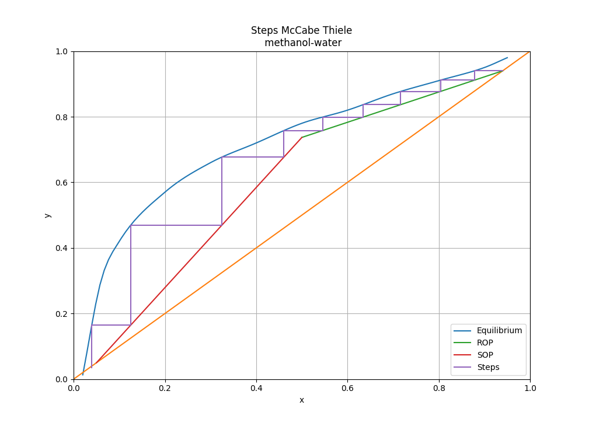

# Transfer mass vizsolver

This Project aims to facilitate the teaching of mass transfer phenomena. Designed in python, it intends to be a library that uses graphical methods and that applies modern equations to predict the behavior of mass transfer.

## Features

Now this repo has a module to graph an example for mcthiele solution to binary destilation

## Credits

This package was created with
[scicookie](https://github.com/osl-incubator/scicookie) project template.
