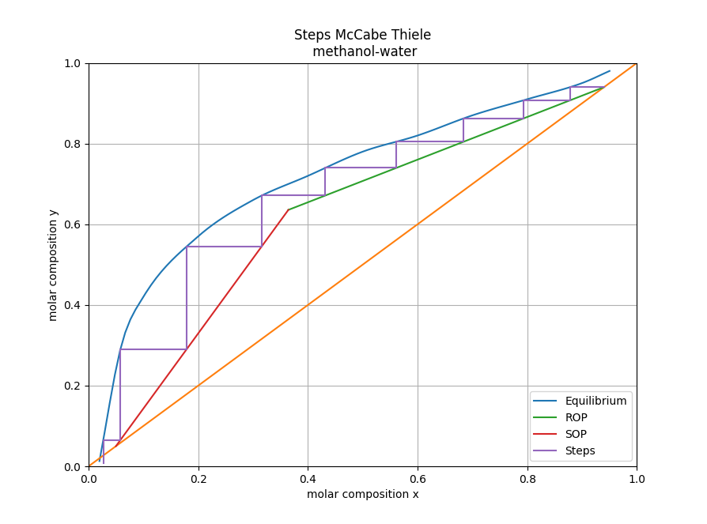

# McCabeThiele module

This class is used to graphically solve binary distillation problems using the McCabeThiele method.

## Brief mathematical intro

The equations used for the solution are:

**Enriching operation line**

$$
y_{n+1} = \frac{R}{R+1} x_n + \frac{1}{R+1} x_D
$$

**Stripping operation line**

$$
y_{m+1} = \frac{L_m}{V_m} x_m + \frac{W}{V_m} x_W
$$

**Feed operation line**

$$
y = \frac{q}{q-1} x - \frac{1}{q-1} x_F
$$

**Where**

$y$, $x$ : Molar compositions in the vapor and liquid phase respectively.

$n$, $m$ : Step in the enriching and stripping section respectively.

$R = L_n/D$ : Reflux

$W$ :  Bottom liquid product.

$L$, $V$ : Liquid and vapor flux in the column (constant in every step).

$q$ : mole fraction of the liquid in the feed.

$$
q = \frac{heat\enspace needed \enspace to \enspace vaporize \enspace 1\enspace mol \enspace of \enspace feed \enspace at \enspace entering \enspace conditions}{molar \enspace latent \enspace heat \enspace of \enspace vaporization \enspace of \enspace feed}
$$

## Example

```python
# importing fqlearn library
from fqlearn.McCabeThiele import McCabeThiele

model = McCabeThiele()

# Set compounds 
model.set_data(compound_a="methanol", compound_b="water")

# Set desired compositions in the distilate (xD) and the Bottom liquid (xW) 
model.set_compositions(xD=0.94, xW=0.05)

# Set feed values 
model.set_feed(q=0.5, xF=0.5)

# Solve the model 
model.solve()

# Print results 
model.describe()

# Plot results
model.plot()
```

After executing the code above you will see:
```bash
- El reflujo mínimo es de: 0.7480780119884876
- La composición líquida de salida: 0.05

### Composición de entrada y salida en cada etapa:
  - Etapa 1: Entrada = 0.9400, Salida = 0.9400
  - Etapa 2: Entrada = 0.8783, Salida = 0.9400
  - Etapa 3: Entrada = 0.8783, Salida = 0.9074
  - Etapa 4: Entrada = 0.7933, Salida = 0.9074
  - Etapa 5: Entrada = 0.7933, Salida = 0.8624
  - Etapa 6: Entrada = 0.6840, Salida = 0.8624
  - Etapa 7: Entrada = 0.6840, Salida = 0.8046
  - Etapa 8: Entrada = 0.5611, Salida = 0.8046
  - Etapa 9: Entrada = 0.5611, Salida = 0.7396
  - Etapa 10: Entrada = 0.4316, Salida = 0.7396

Número total de etapas: 9
```

